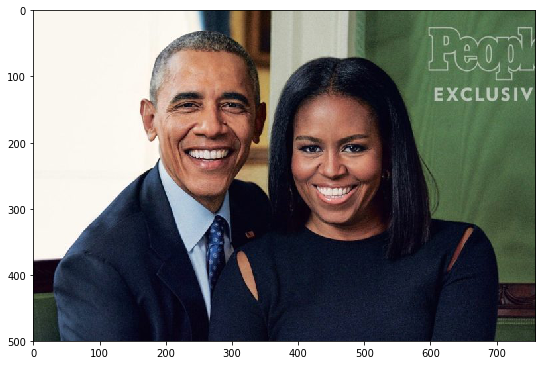
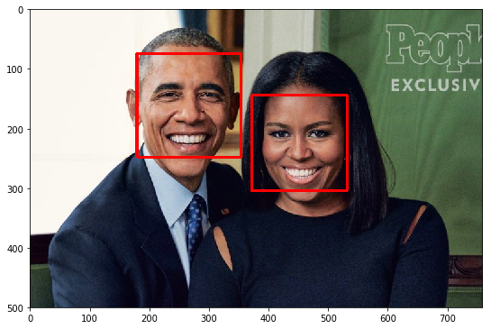
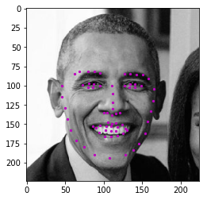
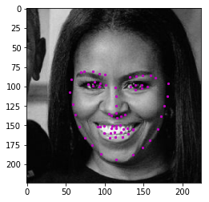

# Facial Keypoint Detection (Computer Vision Nanodegree Project)
  
This project will be all about defining and training a convolutional neural network to perform facial keypoint detection, and using computer vision techniques to transform images of faces.  The first step in any challenge like this will be to load and visualize the data you'll be working with. 

Let's take a look at some examples of images and corresponding facial keypoints.


Facial keypoints (also called facial landmarks) are the small magenta dots shown on each of the faces in the image above. In each training and test image, there is a single face and **68 keypoints, with coordinates (x, y), for that face**.  These keypoints mark important areas of the face: the eyes, corners of the mouth, the nose, etc. These keypoints are relevant for a variety of tasks, such as face filters, emotion recognition, pose recognition, and so on. Here they are, numbered, and you can see that specific ranges of points match different portions of the face.


---

## Demo

To see the working of this project please to [3. Facial Keypoint Detection, Complete Pipeline.ipynb](3.&#32;Facial&#32;Keypoint&#32;Detection,&#32;Complete&#32;Pipeline.ipynb) or to see the applications of this project please refer to [4. Fun with Keypoints.ipynb](4.&#32;Fun&#32;with&#32;Keypoints.ipynb)

---

## Screenshots

```bash
  1. Load image
```


```bash
  1. Face Detection using Haar Cascade
```


```bash
  3. Predicted facial keypoints
```
 
